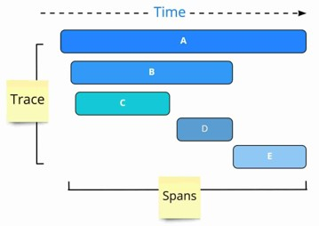
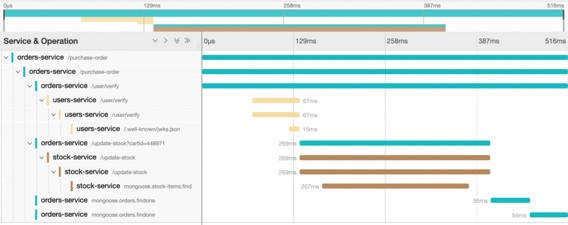
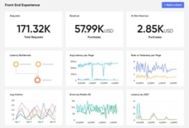
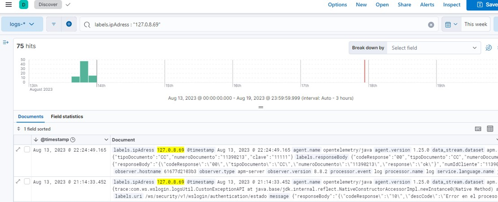
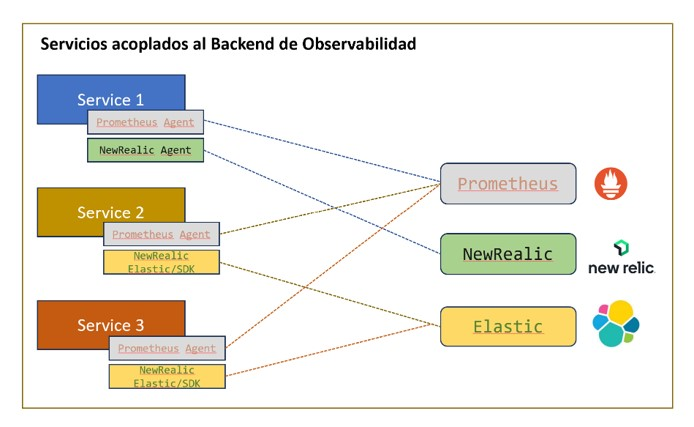
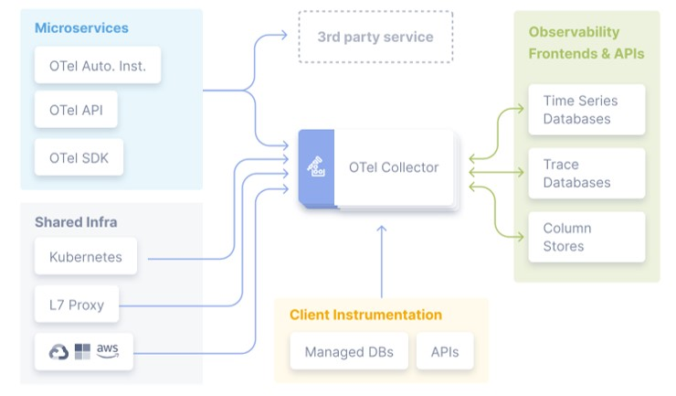
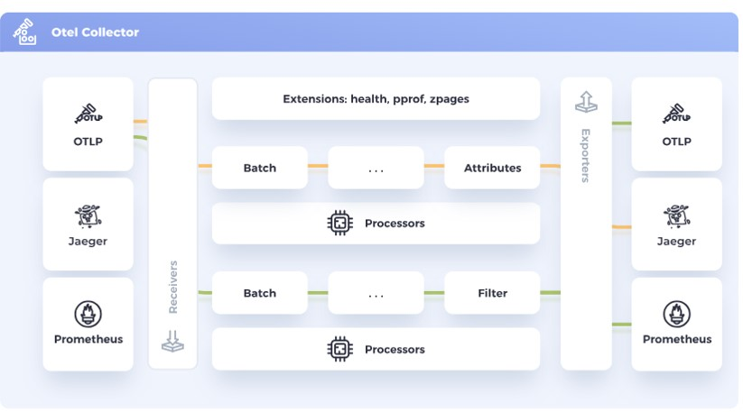
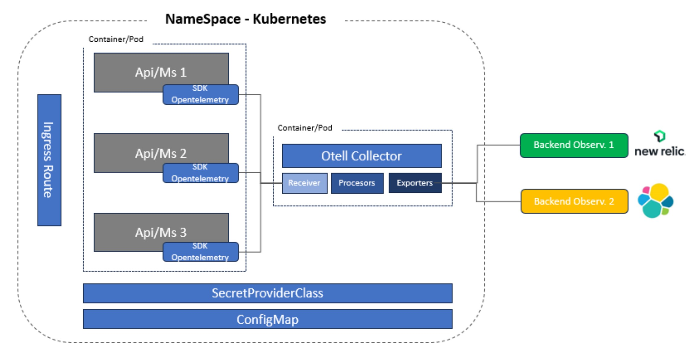
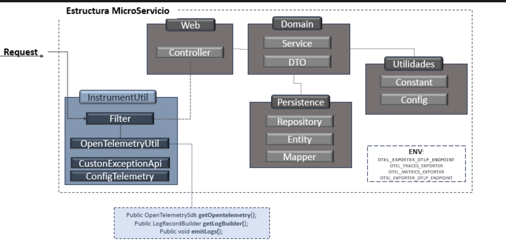

# Telemetry - Microservicios SpringBoot
@ngmartinezs

Este repositorio presenta una contextualizacion, planteamiento y diseño de gestion de telemetria para servicios web implementados en  Spring boot haciendo uso de componetes como openteletry para estandarizar el registro de logs, metricas y trazas,  con el proposito de ser desplegado sobre una tecnologia de administracion de contenedores como podria ser Kubernetes.


## 1. Conceptos Importantes

### 1.1 Telemetry
Telemetría se refiere a la recopilación, análisis y transmisión de datos relacionados con el rendimiento, el estado y el comportamiento de los componentes  de un sistema. Esta información se utiliza para monitorear, diagnosticar y optimizar el funcionamiento de sistemas complejos y distribuidos.

+ Monitorizacion De Rendimiento
+ Deteccion de Problemas
+ Diagnostico y Resolucion de Problemas
+ Escalabilidad 
+ Despliegues
+ Seguridad

### 1.2 Observabilidad
La observabilidad hace referencia a la capacidad de comprender, analizar y depurar sistemas complejos mediante la recopilación, análisis y visualización de datos y métricas relevantes para el sistema. 

La observabilidad va más allá del simple monitoreo y se enfoca en obtener una comprensión profunda de cómo opera un sistema en tiempo real y cómo se comporta en diferentes situaciones.

#### 1.2.1 Traces
Seguimiento de las interacciones entre los componentes de un sistema a lo largo del tiempo. Los traces permiten visualizar cómo una solicitud fluye a través de diferentes servicios y recursos.

   


#### 1.2.2 Metricas
Datos cuantificables que representan el rendimiento y la salud del sistema. Ejemplos de métricas incluyen el uso de CPU, la latencia, el tiempo de respuesta y la cantidad de solicitudes por segundo.


#### 1.2.3 Logs
Registros detallados de eventos y acciones que ocurren en un sistema. Los logs proporcionan información cronológica y detallada sobre lo que sucede en cada componente.



### 1.3 Backend de Observabilidad
En el mercado existen un buen numero de herramientas de observabilidad con las cuales se puede realizar el monitoreo y observabilidad de sistemas distribuidos, ingestando datos de las aplicaciones y analizando esta informacion en tiempo real.

+ `Prometheus`: Una herramienta de monitoreo y alerta de código abierto que recopila métricas de sistemas y servicios. Utiliza un modelo de datos dimensional y es altamente escalable.

+ `Grafana`: A menudo utilizado junto con Prometheus, Grafana es una plataforma de visualización que permite crear paneles personalizados y gráficos a partir de los datos de observabilidad.

+ `Elasticsearch, Logstash y Kibana (ELK Stack)`:  Elasticsearch es una base de datos y motor de búsqueda, Logstash es una herramienta de procesamiento de datos y Kibana es una plataforma de visualización. Juntos, forman una pila conocida como ELK Stack que se utiliza para analizar logs y métricas.

+ `New Relic`: Ofrece monitoreo de rendimiento de aplicaciones y servicios, proporcionando visibilidad en el rendimiento, las métricas y los errores en tiempo real.

+ `Datadog`: Una plataforma de monitoreo y analítica que recopila métricas y eventos de sistemas, aplicaciones y servicios para proporcionar información sobre el rendimiento y la salud.

+ `Dynatrace`: Proporciona monitoreo y analítica de rendimiento de aplicaciones y sistemas en tiempo real, utilizando inteligencia artificial para detectar y resolver problemas automáticamente.

+ `Jaeger`: Jaeger es un software que puede utilizar para supervisar y solucionar problemas de componentes de software interconectados.

### 1.5 Interaccion Con Backend de Observabilidad

La interaccion entres los sistemas distribuidos o componentes de software y la variedad de backends de observabilidad puede ocasionar que se genere una acoplamiento entre estos componenstes  y los backends, generando dificultades cuando se requiren efectuar cambios en la ingesta de metricas o logs.  Adicionalmente teniendo en cuenta que si los componentes de software presentan integracion por medio de SDK.


### 1.6 Open Telemetry
OpenTelemetry, también conocido como OTel para abreviar, es un framework de observabilidad de código abierto e independiente del proveedor para instrumentar, generar, recopilar y exportar datos de telemetría, como seguimientos , métricas y registros .



#### 1.4.1 OTELCollector

OpenTelemetry Collector es una implementación que permite independizar las piezas de software de los backend de observabilidad, presentando un elemento que permite recibir, procesar y exportar datos de telemetría.  Elimina la necesidad de ejecutar, operar y mantener múltiples agentes/recopiladores. Esto funciona con una escalabilidad  y admite formatos de datos de observabilidad de código abierto (p. ej., Jaeger, Prometheus, Fluent Bit, etc.) que se envían a uno o más back-end comerciales o de código abierto. 

El Otel Collector esta comformado por tres componenetes principales: Receivers,  Procesors y Exporters



##### Receiver
El receiver es el componentes del otel collector que se encarga de recepcionar los datos que se requieren enviar al backend de observabilidad, mediante diferentes protocolos de comunicaciones htlm/OLTP
```
 receivers:
     otlp:
       protocols:
         grpc:
         http:
```
##### Procesors
Los procesors o procesadores son el componente del OtelCollector que se encarga de procesar los datos de traszas, metricas o logs que son enviados por los recerivers.   Los procesadores cuanta con una serie de parametros que le permiten cambiar su comportamiento al momento de procesar la informacion, entre ellos la capacidad de almacenamiento de datos, la frecuencia de la entrega de la informacion y el tipo de procesamiento.  Ademas de ellos tiene la capacidad para efectuar ciertos tratamientso sobre la data procesada a fin de cambiar u omitir cierta informacion que se  procesa.
```
     processors:
     memory_limiter:
       check_interval: 1s
       limit_mib: 2000
     batch:   
       send_batch_size: 10000
       timeout: 10s
```
##### Exporters
Los exportes son los componentes del OtelCollector que recibe la informacion collectada en los procesadores y los remite a los backend de observabilidad que se tiene configurados dentro de las propiedades del exporter.
```
    exporters:
     logging:
       verbosity: normal
     otlphttp/elastic:
        endpoint: ${ELASTICSEARCH_URL}
        compression: none
        tls:
          insecure: false
        headers:
          Authorization: ${ELASTICSEARCH_API_KEY}
     otlphttp/newrelic:
        endpoint: ${NEW_RELIC_URL}
        headers:
          api-key: ${NEW_RELIC_API_KEY}
        compression: none
        tls:
          insecure: false
```

## 2. Diseño Propuesto
Se plante  realizar una prueba de concepto en la cual se pueda modelar e implementar una esquema de solucion para la ingesta de logs, metricas y trazas para servicios desarrollados en Spring Boot hacia un backend de observabilidad, haciendo uso de OpenTelemetry y  haciendo uso de una proceso de instrumentacion manual que nos permitiera tener control sobre los diferentes  valores que se quieren ingestar.

### 2.1 Stack Tecnologico
+ Java 17
+ Maven
+ Docker
+ Kubernetes
+ Open Telemetry
+ Elastic Search
+ New Realic

### 2.2 Propuesta Conceptual
La propuesta de diseño se plantea en base a una solucion contenerizada,  en donde tanto los microservicios o Apis estan contenerizadas y desplegadas una stack de Kubernetes, dichos servicios se encuentra agrupados por dominios de informacion en diferentes espacios de nombres.  



Basado esta propuesta de diseño conceptual, se plantean las siguientes lineas base:
+ Dado que la propuesta de concepto se base en una distribucion logica del AKS por medio de namespace, cada namespace debera contar con una plantilla de deployment y services que permitan generar POD del componente Otell Collector.
+ Bajo cada namespace  se debera establecer un Objeto ConfigMap de Kubernetes en el cual se llevaran trasversales que le puedan ser util a proyecto mas la informacion de parametrizacion del OtellCoolector 
+ Las comunicacion entre los POD de apis y el Otel Collector, se realizar por medio de resolucion interna de FQDN (http://name-service-k8s.namespacer.svc.cluster.local:port), a fin de no  generar trafico hacia afuera del cluster de Kubernetes.
+ Los microservicios o apis que ingestan logs, metricas o trazas tener una instrumentacion manual haciendo uso del SDK de OpenTelemetry

### 2.3 Diseño MS/API



El componente InstrumentUtil  es el paquete que contiene las clases que permiten la instrumentacion de los logs, metricas y trazas,  este componente se encuentra en el repositorio de codigo fuente de cada microservicio o api,  y se encuentra compuesto por las siguientes clases:
+ LoggingFilter: Clase que se encarga de interceptar las peticiones que se realizan al microservicio o api,  y genera los logs de entrada y salida de la peticion.
+ OpenTelemetryUtil: Clase que se encarga de generar las metricas y trazas de las peticiones que se realizan al microservicio o api,  y genera los logs de entrada y salida de la peticion.
+ OpenTelemetryConfig: Clase que se encarga de configurar el OpenTelemetry,  y generar el tracer que se utiliza para generar las metricas y trazas de las peticiones que se realizan al microservicio o api,  y genera los logs de entrada y salida de la peticion.
+ CustomExceptionAPI:  clase que representa una exceptip
